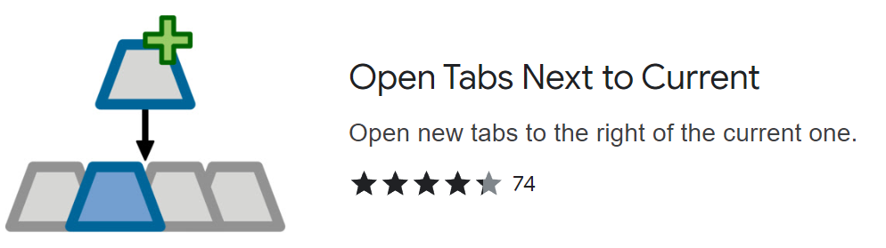

# Tab Utils Chrome Extension

A manifest v3 browser extension that integrates several useful tab management utilities that make browsing experience smoother.

Every feature can be turned off either in popup settings panel or by not assigning a hotkey for it.

## Features

- **open new tab next to current tab**.
  - similar to a previous chrome extension has implemented this function which became unavailable since chrome enforced migration from manifest v2 to v3.
  - 

- **duplicate current tab**: 
  - similar to [Duplicate Tab Shortcut](https://chromewebstore.google.com/detail/duplicate-tab-shortcut/klehggjefofgiajjfpoebdidnpjmljhb) extension.
  - support using a custom key to duplicate current tab.

- **display tab count**: Shows alternating current window / total tab count as a number on the extension icon (when pinned)
- **Settings Popup**: Click extension icon to configure features

## Build

### build the popup panel page using pnpm.
```bash
cd popup
pnpm install
pnpm build
```

Built files will be placed in `./popup/build/`

## Installation for Chrome
1. git clone this repo.
1. build the popup (see above)
2. Go to `chrome://extensions/` in chrome browser.
3. Enable "Developer mode"
4. Click "Load unpacked"
5. Select the `tab-utils-mv3` folder